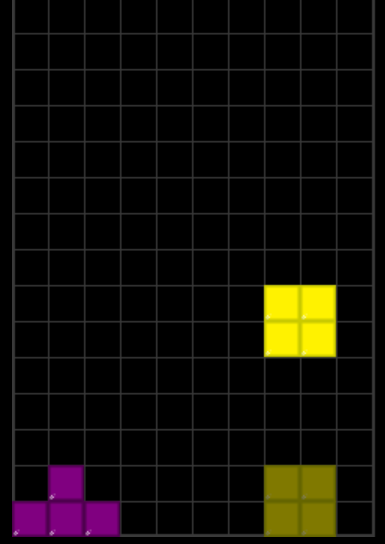

# Finess Finess Finess
## If there was only one thing to take away from this it would be Finess
**Finess** is how effecient you are at moving your pieces. 
For example lets say I have a an open board and will soon be placing my first piece _**(how exciting!!!)**_  
Well it looks like I'll be placing a T-block first and I'd like to get it all the way on the left:  

  
There are two ways you could get this block here.
	1. You could tap the left arrow three time
	2. You could hold the left arrow untill the piece hits the wall. 
The second way would save you 2 inputs (this will add **Way** up over the course of 40 seconds) 
Go back to the clip I linked to see that I had 14 finess or in otherwards I was 14 button presses off of being perfectly effecient.  
If you can learn to rotate the pieces and keep a good stack finess will become much easier.

